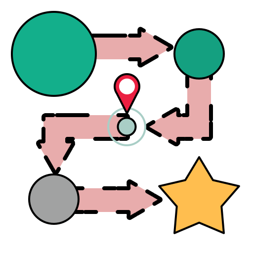

  
  <h1>JourneyKMP Graph</h1>
  
A companion graph visualizer for <a href="https://github.com/jianastrero/JourneyKMP">JourneyKMP</a> — turns your <code>@Journey</code>-annotated navigation flows into interactive directed graphs inside IntelliJ IDEA.

  
  
  

---

## Demo

<video src="assets/demo.mp4" controls width="100%"></video>

---

## Features

- **Auto-detects** all `@Journey`-annotated sealed interfaces in your project
- **Interactive canvas** with draggable nodes
- **Horizontal and vertical** layout modes
- **Zoom in/out**, fit to view, and reset zoom
- **Piggyback tag visualization** — shows `ON_ENTER` and `ON_EXIT` lifecycle events on each node
- **Export** as Mermaid diagram or PNG
- **Light and dark theme** support, independent of the IDE theme

---

## Requirements

- IntelliJ IDEA 2023.2+ (or Android Studio Meerkat+)
- [JourneyKMP](https://github.com/jianastrero/JourneyKMP) in your project

---

## Installation

1. Open IntelliJ IDEA
2. Go to **Settings → Plugins → Marketplace**
3. Search for **JourneyKMP Graph**
4. Click **Install**

Or install manually from the [JetBrains Marketplace](https://plugins.jetbrains.com).

---

## Usage

1. Open any project that uses [JourneyKMP](https://github.com/jianastrero/JourneyKMP)
2. Open the **JourneyKMP Graph** tool window (right sidebar)
3. Select a `@Journey` flow from the dropdown
4. Explore the graph — drag nodes, zoom, switch layouts

The graph updates automatically whenever you save a `.kt` file.

---

## How it works

The plugin scans your project's Kotlin source files directly via PSI (no build required) and looks for sealed interfaces annotated with `@Journey`. It parses the `@Step`, `@Exit`, and `@Piggyback` annotations to build a directed graph, then renders it as an interactive canvas.

---

## License

[MIT](LICENSE) © [Jian James Astrero](https://github.com/jianastrero)
